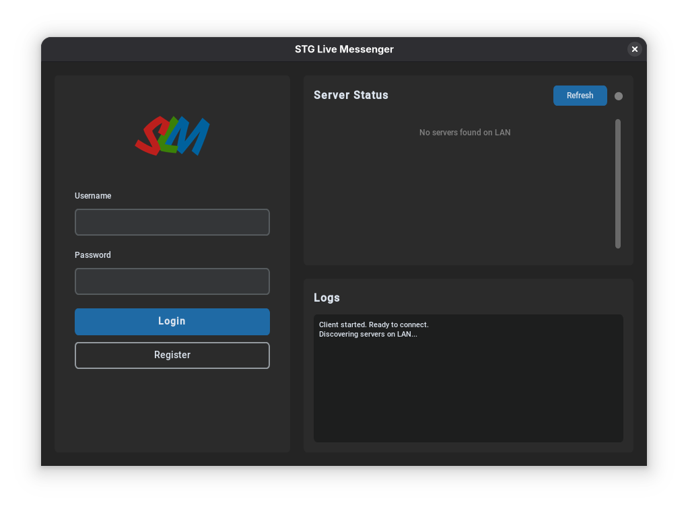

# STG Live Messenger


## Features

- **Secure Messaging**: End-to-end encrypted messaging using DES encryption
- **Message Titles**: Add optional titles to your messages for better organization
- **User Registration**: Register with username, password, and profile picture
- **Message Inbox**: View all received messages with sender, title, and content
- **Server Discovery**: Automatic discovery of servers on the local network using mDNS

## Message Structure

Messages in STG Live Messenger now support the following fields:

- **From**: Sender username
- **To**: Recipient username
- **Title**: Optional message title/subject
- **Body**: The encrypted message content
- **Created At**: Timestamp when the message was sent

## Login Screen



## Dependicies

> [!WARNING]
> Use `pycryptodome` instead of `pycrypto`

```text
certifi==2025.11.12
charset-normalizer==3.4.4
customtkinter==5.2.2
darkdetect==0.8.0
idna==3.11
ifaddr==0.2.0
Naked==0.1.32
packaging==25.0
pillow==12.0.0
pycryptodome==3.23.0
PyYAML==6.0.3
pyzmq==27.1.0
requests==2.32.5
shellescape==3.8.1
urllib3==2.5.0
zeroconf==0.148.0
```
